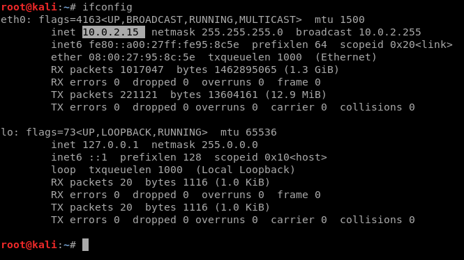
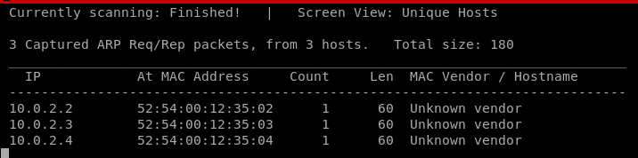
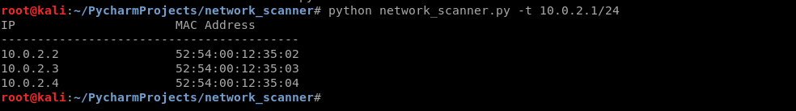

# network_scanner
> This project was created to scann subnetwork and show all IP and MAC Adresses of the users in this network.

## Technologies
* Python(work in 2 and 3)
### Libraries
* scapy
* optparse
## Setup
To run this program you have to run network_scanner.py and give a target.

## Action
The goal was to create a program similar to "netdiscover" installed in Kali Linux. To run it we need our ip f.e:
 
This program after write in terminal `netdiscover -r 10.0.2.1/24` will show: 
 

My programm need to give him a target ip (You can see help by add --help). To give it you have to write -t or --target and give your ip. In my example program look like:
 
